前章ではプレイヤーが移動するところまで出来ました。
次はプレイヤーが自動で弾を連射するようにします。


### <span id="column-12"></span>親子関係


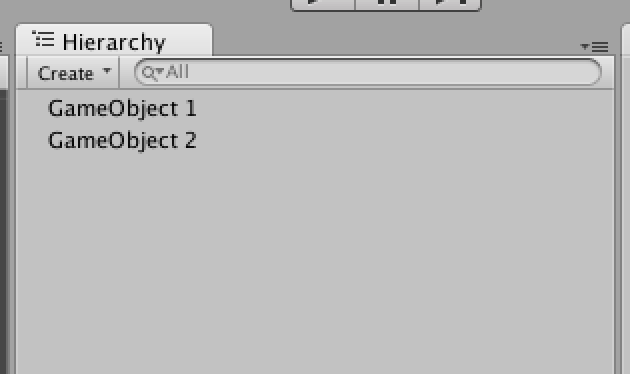
<br/>図3.1:


Unityでは、「親子関係」という言葉を使います。これはゲームオブジェクト同士の関係性を表しています。
普段、ゲームオブジェクトは図3.1のように縦に並びます。これは同じ位置にゲームオブジェクトが存在することになり、それぞれは独立しています。


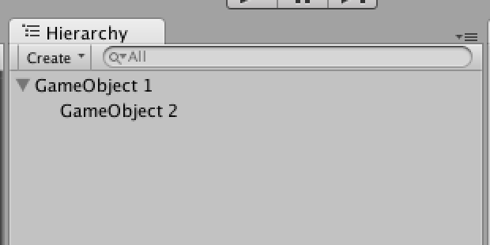
<br/>図3.2:


<br/>図3.2は**GameObject 1が親**、**GameObject
2が子**として関係を持ちます。これは子であるGameObject
2が、親のGameObject
1の影響を受けることになります。例えば親が移動・回転を行えば子も同じように移動・回転を行います。


<span id="h3-1"></span>3.1　プレイヤーの弾を作成する
----------------------------------------------------

プレイヤーの弾となる`Bullet_0`スプライトをシーンビューへドラッグ＆ドロップします。


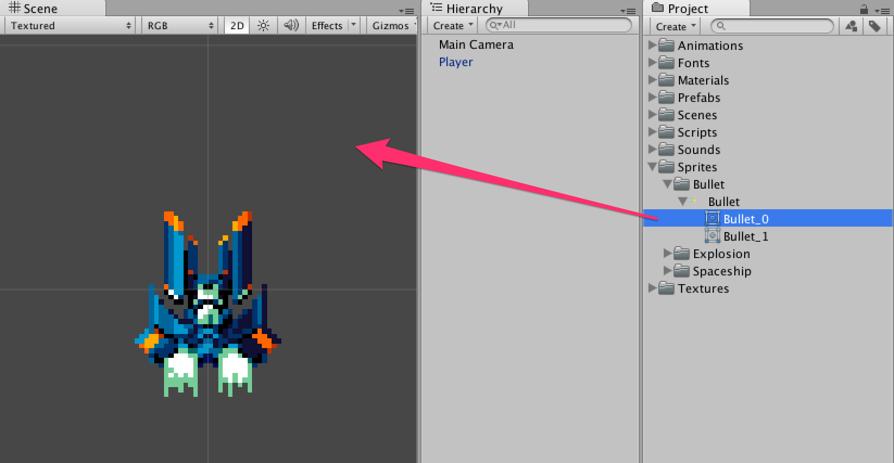
<br/>図3.3:


今回は名前を**Bullet**としました。


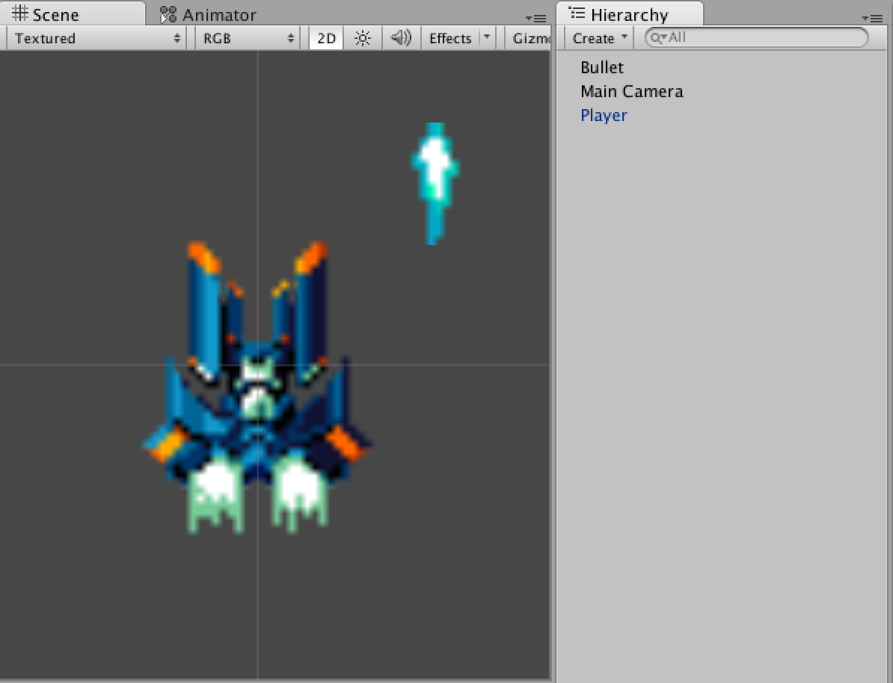
<br/>図3.4:


<span id="h3-2"></span>3.2　プレイヤーの弾を動かす
--------------------------------------------------

**ゲームを再生したら勝手に上に飛んで行く弾**を作成しましょう。


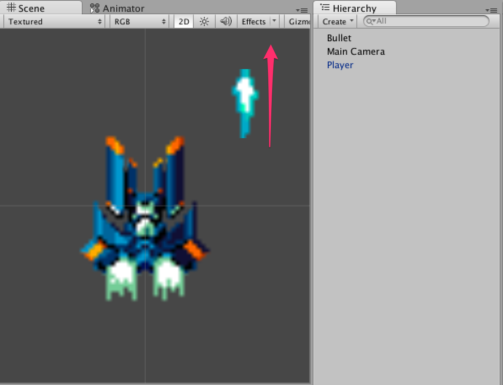
<br/>図3.5:


### <span id="h3-2-1"></span>親となるPlayerBulletの作成

**空のゲームオブジェクト**を作成します。作成した空のゲームオブジェクトの名前を**PlayerBullet**としてください。


### <span id="column-13"></span>空のゲームオブジェクトを作る

空のGameObjectはメニューの[Game Object] -\> [Create
Empty]から作成できます。
空のGameObjectは**Transformコンポーネントのみがアタッチされている状態**のことを指します。


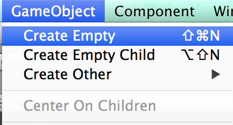
<br/>図3.6:


**PlayerBullet**に「Rigidbody2D」をアタッチし、**Gravity
Scale**を**0**にします。


<br/>図3.7: PlayerBulletゲームオブジェクトのインスペクター


Player Bulletの位置はプレイヤーの中心位置にしましょう。

> 中心位置はPlayerとPlayerBulletを(0,0,0)の位置に移動することで調整しやすくなります。


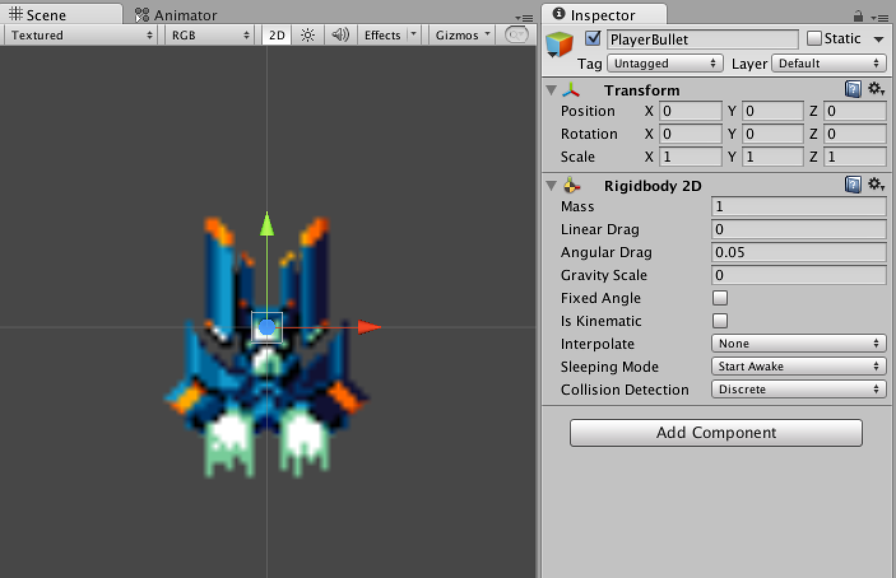
<br/>図3.8:


Bulletを複製します。ヒエラルキーウィンドウにあるBulletゲームオブジェクトの上で右クリックをして「Duplicate」を選択します。


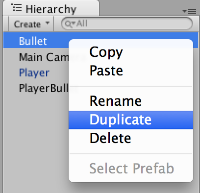


それぞれのBulletを以下のように配置します。 左のBullet: **X -0.14 Y 0 Z
0** 右のBullet: **X 0.14 Y 0 Z 0**


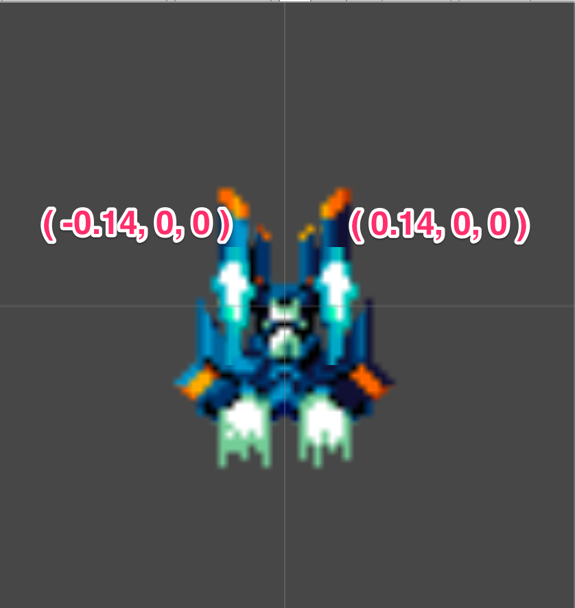


そして２つのBulletをPlayerBulletの子要素となるようにドラッグ＆ドロップしましょう。


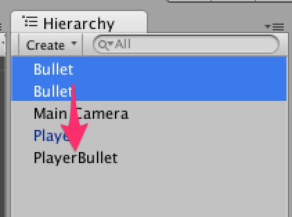


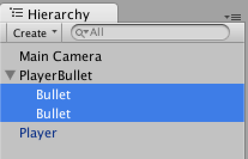


最後に、PlayerBulletをPrefab化しましょう。


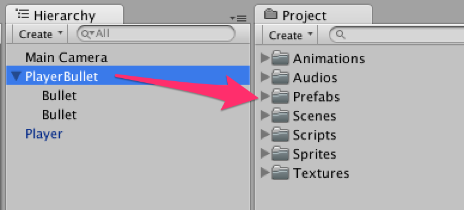
<br/>図3.9: Prefabsフォルダを作成してください


### <span id="h3-2-2"></span>弾を動かす

次にBullet.csファイルをScriptsフォルダの中に作成します。プレイヤーの移動と同じようにrigidbody2D.velocityを使って弾を移動させます。
今回は速度ベクトルは1度のみ変更すれば良いので**Start**メソッド内で速度ベクトルの代入を行いましょう。


Bullet.cs

```cs
using UnityEngine;

public class Bullet : MonoBehaviour
{
    public int speed = 10;

    void Start ()
    {
        rigidbody2D.velocity = transform.up.normalized * speed;
    }
}
```


Bullet.csを**PlayerBullet**にアタッチします。**Bulletではないので注意してください**


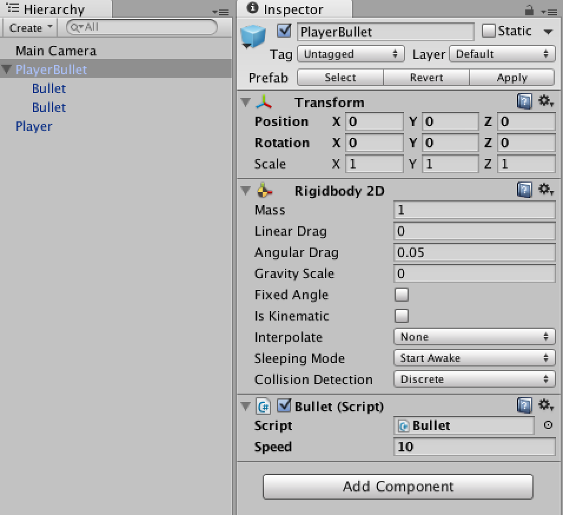
<br/>図3.10:


この段階でゲームを再生してみましょう。
再生と同時に弾が上に飛んでいきましたか？


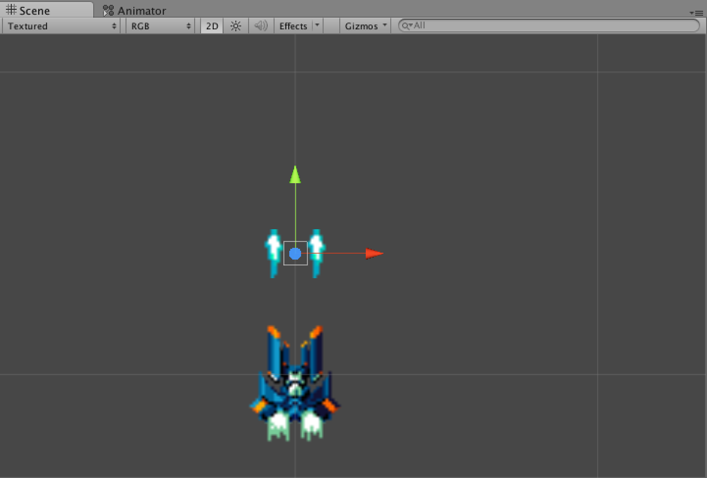
<br/>図3.11:


PlayerBulletのPrefabの更新を行いましょう。Applyを必ず押してください。


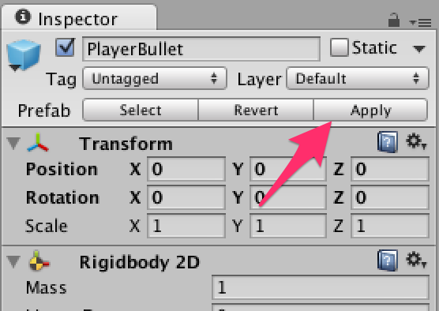
<br/>図3.12:


<span id="h3-3"></span>3.3　プレイヤーから弾を発射する
------------------------------------------------------

作成した**PlayerBullet**のPrefabを使ってスクリプト側からゲームオブジェクトを作成し、弾を発射します。
その前に、シーン上にある**PlayerBulletを削除しましょう。**ヒエラルキーウィンドウにあるPlayerBulletゲームオブジェクトの上で右クリックをして「Delete」を選択します。


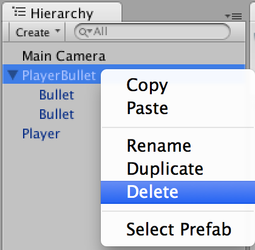
<br/>図3.13:


Startメソッドを**コルーチン**として呼び出し、0.05秒ごとに弾を撃つようにしてみましょう。


### <span id="column-14"></span>**コルーチン (Coroutine)**

時間のかかる処理や、何かを待機するような処理をUpdateメソッド内で行うと、その処理が終わるまでゲームの進行がストップしてしまいます。
このような処理は数秒待機したり、特定の処理が終わるまで待機することが可能なコルーチンを利用します。
詳しくはドキュメントの[Coroutines](http://docs.unity3d.com/ja/current/Manual/Coroutines.html)を御覧ください。


Player.cs

```cs
using UnityEngine;
using System.Collections;

public class Player : MonoBehaviour
{
    // 移動スピード
    public float speed = 5;

    // PlayerBulletプレハブ
    public GameObject bullet;

    // Startメソッドをコルーチンとして呼び出す
    IEnumerator Start ()
    {
        while (true) {
            // 弾をプレイヤーと同じ位置/角度で作成
            Instantiate (bullet, transform.position, transform.rotation);
            // 0.05秒待つ
            yield return new WaitForSeconds (0.05f);
        }
    }

    void Update ()
    {
        // 右・左
        float x = Input.GetAxisRaw ("Horizontal");

        // 上・下
        float y = Input.GetAxisRaw ("Vertical");

        // 移動する向きを求める
        Vector2 direction = new Vector2 (x, y).normalized;

        // 移動する向きとスピードを代入する
        rigidbody2D.velocity = direction * speed;
    }
}
```


`public GameObject bullet;`というようにpublicで変数を宣言すると、インスペクター上にゲームオブジェクトを格納するための場所が表示されます。
ここに**PlayerBullet**のPrefabを格納しましょう。


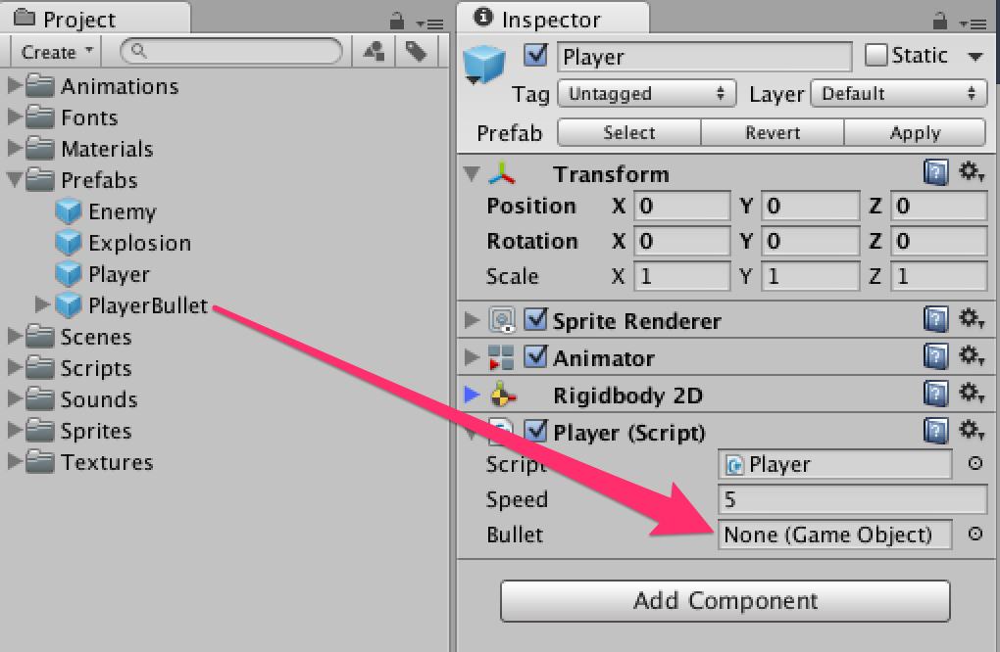
<br/>図3.14:


さて、ゲームを再生してみましょう。弾が発射されていますか？


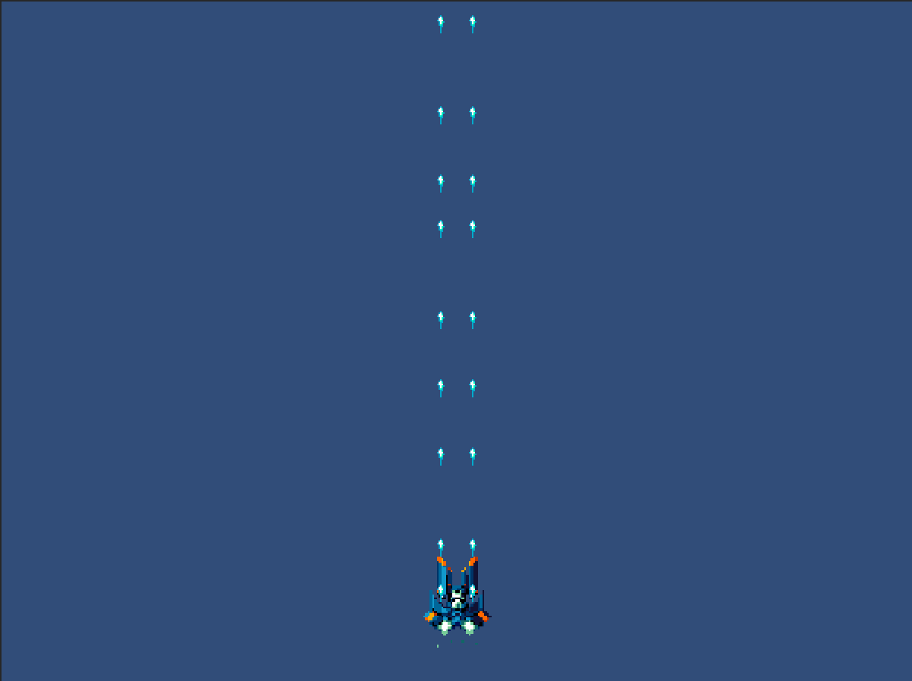
<br/>図3.15:


<span id="h3-4"></span>3.4　スプライトの描画順
----------------------------------------------

弾が発射されるようになりましたが、ここで気になる点があります。弾がプレイヤーの上に表示されてしまっています。これでは発射口からたまが出ていることにならず違和感を覚えます。


<br/>図3.16: 弾がプレイヤーの上に表示されている状態


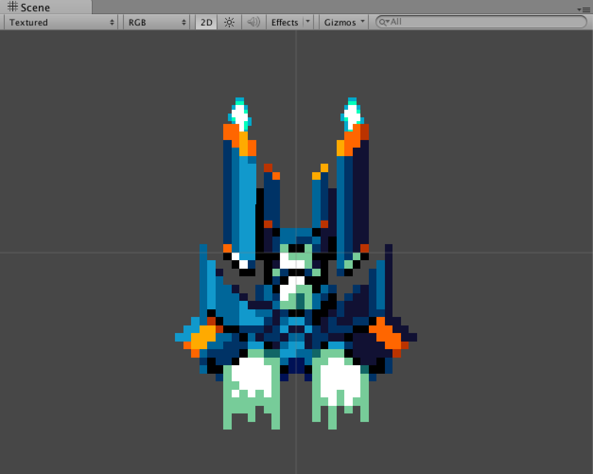
<br/>図3.17: 弾がプレイヤーの下に表示されている状態


### <span id="h3-4-1"></span>**Sorting Layer (ソーティングレイヤー)**

スプライトの描画順を変更するには**Sorting Layer**を使用します。
`Edit -> Project Settings -> Tags and Layers`を選択してください。


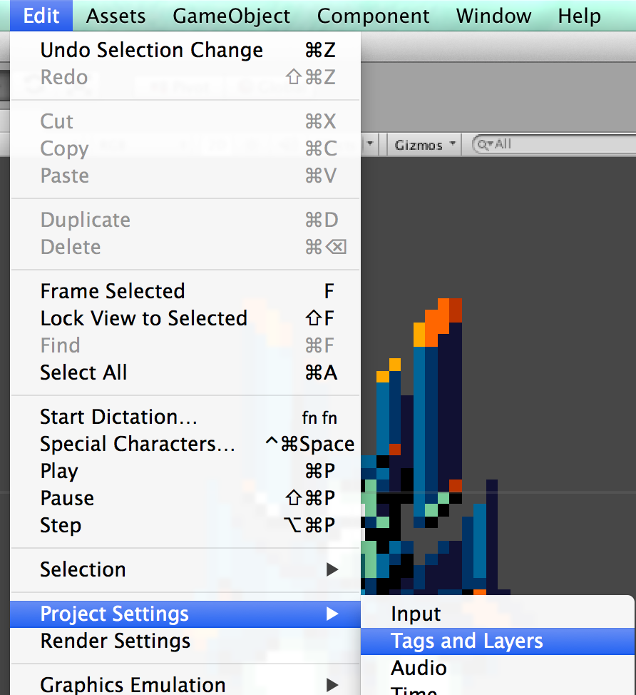


「**+**」ボタンを押してレイヤーを追加します。レイヤー名が**Bullet**と**Player**の2つを作成します。
**必ず順序は上からDefault、Bullet、Playerにしてください。この順序が描画順になります。**


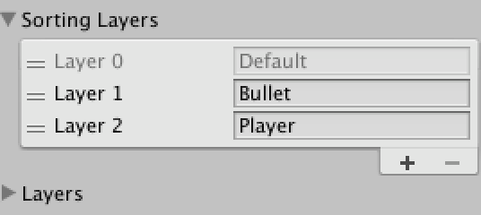


次に、先ほど追加したSorting Layerを適用します。
PlayerBulletブレハブの中のBulletを2つ選択し、インスペクターにあるSorting
LayerをDefaultからBulletへ変更します。


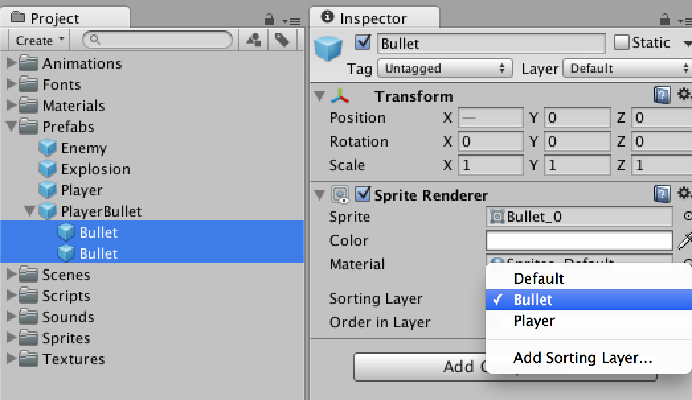


Playerゲームオブジェクトを選択し、インスペクターにあるSorting
LayerをDefaultからPlayerへ変更します。


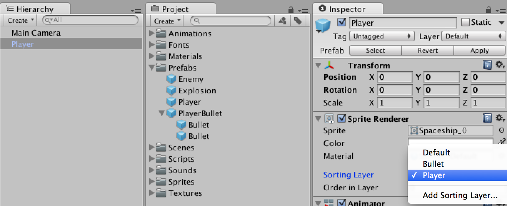


ゲームを再生してみましょう。弾がプレイヤーの下に描画されるようになったはずです。
最後に、PlayerのPrefabを更新しましょう。

### 第03回終わり

今回はここで終了です。つまずいてしまった方はプロジェクトファイルをダウンロードして新たな気持ちで次の回へ進みましょう。

[今回のプロジェクトファイルをダウンロード](project/game_03_ShootingGame.zip)
