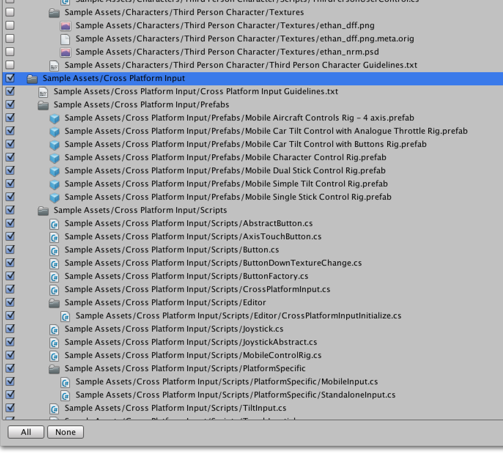
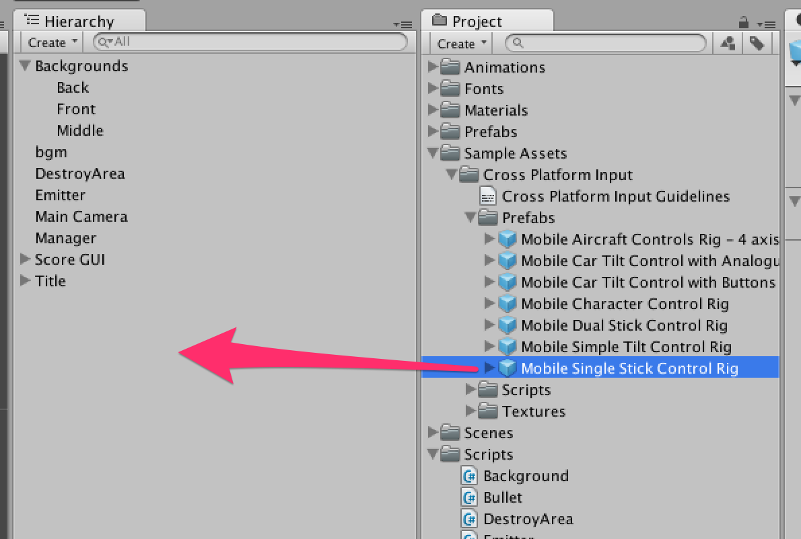
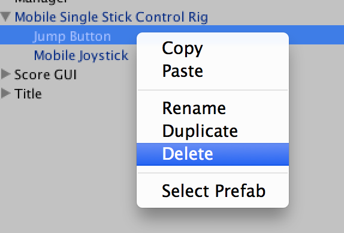
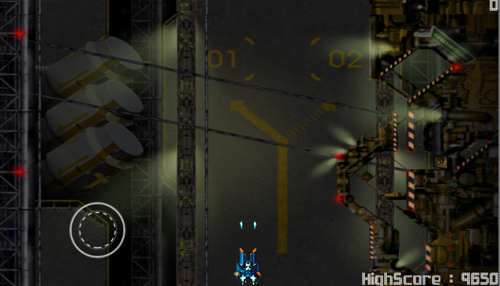

この回はモバイル編第03回終了時点のプロジェクトを使用します。

<span id="h4-1"></span>4.1　バーチャルジョイスティックをアセットストアからダウンロード
--------------------------------------------------------------------------------------

今回はバーチャルジョイスティックを作成せずに、アセットストアにあるものを使用します。


<br/>図4.1: Unity Technologiesが提供しているSample Assets


[Sample
Assets](https://www.assetstore.unity3d.com/#/content/14474)の中にある**Cross
Platform Input**をインポートしてください。

**その他はインポートを行う必要ありません。Physics2DSettings**と**TagManager**をインポートしてしまうとタグやレイヤー設定が変更され、ゲームが正しく動かなくなります。気をつけてください。



<br/>図4.2:


**Mobile Single Stick Control
Rig**のプレハブをヒエラルキービューにドラッグ＆ドロップしてください。





**Mobile Single Stick Control Rig**の子要素の**Jump
Button**を削除します。





これでバーチャルジョイスティック設置が出来ました。





次にバーチャルジョイスティックの入力を受け取ります。受け取り方はInputクラスではなく**CrossPlatformInput**クラスを使用します。


Player.cs

```cs
using UnityEngine;
using System.Collections;

public class Player : MonoBehaviour
{
    // Spaceshipコンポーネント
    Spaceship spaceship;

    IEnumerator Start ()
    {
        // Spaceshipコンポーネントを取得
        spaceship = GetComponent<Spaceship> ();

        while (true) {

            // 弾をプレイヤーと同じ位置/角度で作成
            spaceship.Shot (transform);

            // ショット音を鳴らす
            audio.Play ();

            // shotDelay秒待つ
            yield return new WaitForSeconds (spaceship.shotDelay);
        }
    }

    void Update ()
    {
        // 右・左
        float x = CrossPlatformInput.GetAxisRaw ("Horizontal");

        // 上・下
        float y = CrossPlatformInput.GetAxisRaw ("Vertical");

        // 移動する向きを求める
        Vector2 direction = new Vector2 (x, y).normalized;

        // 移動の制限
        Move (direction);

    }

    // 機体の移動
    void Move (Vector2 direction)
    {
        // 画面左下のワールド座標をビューポートから取得
        Vector2 min = Camera.main.ViewportToWorldPoint (new Vector2 (0, 0));

        // 画面右上のワールド座標をビューポートから取得
        Vector2 max = Camera.main.ViewportToWorldPoint (new Vector2 (1, 1));

        // プレイヤーの座標を取得
        Vector2 pos = transform.position;

        // 移動量を加える
        pos += direction * spaceship.speed * Time.deltaTime;

        // プレイヤーの位置が画面内に収まるように制限をかける
        pos.x = Mathf.Clamp (pos.x, min.x, max.x);
        pos.y = Mathf.Clamp (pos.y, min.y, max.y);

        // 制限をかけた値をプレイヤーの位置とする
        transform.position = pos;
    }

    // ぶつかった瞬間に呼び出される
    void OnTriggerEnter2D (Collider2D c)
    {
        // レイヤー名を取得
        string layerName = LayerMask.LayerToName (c.gameObject.layer);

        // レイヤー名がBullet (Enemy)の時は弾を削除
        if (layerName == "Bullet (Enemy)") {
            // 弾の削除
            Destroy (c.gameObject);
        }

        // レイヤー名がBullet (Enemy)またはEnemyの場合は爆発
        if (layerName == "Bullet (Enemy)" || layerName == "Enemy") {
            // Managerコンポーネントをシーン内から探して取得し、GameOverメソッドを呼び出す
            FindObjectOfType<Manager> ().GameOver ();

            // 爆発する
            spaceship.Explosion ();

            // プレイヤーを削除
            Destroy (gameObject);
        }
    }
}
```


ゲームを再生してみましょう。バーチャルジョイスティックでプレイヤーの移動が可能になっているはずです。

### <span id="h4-1-1"></span>第04回終わり

今回はここで終了です。今回はAssetStoreにあるアセットを使用しているのでプロジェクトのダウンロードはありません。
