プレイヤーの作成から移動、弾を撃つまで出来たら次は敵を作成しましょう。
基本的には、プレイヤーの作成手順とほぼ変わりません。

<span id="h4-1"></span>4.1　スクリプトの使い回し
------------------------------------------------

前章までに実装したスクリプトには敵でも使用できる部分がいくつかあります。
そこで共通部分を取り出し、**別のコンポーネント**としてみましょう。

### <span id="h4-1-1"></span>Spaceship.csの作成

新たに**Spaceship.cs**をScriptsフォルダの中に作成します。プレイヤーと敵で共通するであろう部分を**Spaceship.cs**に実装していきます。


Spaceship.cs

```cs
using UnityEngine;

// Rigidbody2Dコンポーネントを必須にする
[RequireComponent(typeof(Rigidbody2D))]
public class Spaceship : MonoBehaviour
{
    // 移動スピード
    public float speed;

    // 弾を撃つ間隔
    public float shotDelay;

    // 弾のPrefab
    public GameObject bullet;


    // 弾の作成
    public void Shot (Transform origin)
    {
        Instantiate (bullet, origin.position, origin.rotation);
    }

    // 機体の移動
    public void Move (Vector2 direction)
    {
        rigidbody2D.velocity = direction * speed;
    }
}
```


### <span id="column-15"></span>RequireComponent

「必ず必須なコンポーネント」を指定することが出来ます。必須と指定されたコンポーネントはRequireComponent属性の付いているコンポーネントが削除されない限り、決して削除することが出来ません。詳しくは[RequireComponent](http://docs.unity3d.com/ja/current/ScriptReference/RequireComponent.html)を御覧ください。


次は**Player.cs**の共通化された部分を修正していきます。
Startメソッドの中で`GetComponent`を使いSpaceshipコンポーネントを取得しています。


Player.cs

```cs
using UnityEngine;
using System.Collections;

public class Player : MonoBehaviour
{

    // Spaceshipコンポーネント
    Spaceship spaceship;

    IEnumerator Start ()
    {
        // Spaceshipコンポーネントを取得
        spaceship = GetComponent<Spaceship> ();

        while (true) {

            // 弾をプレイヤーと同じ位置/角度で作成
            spaceship.Shot (transform);

            // shotDelay秒待つ
            yield return new WaitForSeconds (spaceship.shotDelay);
        }
    }

    void Update ()
    {
        // 右・左
        float x = Input.GetAxisRaw ("Horizontal");

        // 上・下
        float y = Input.GetAxisRaw ("Vertical");

        // 移動する向きを求める
        Vector2 direction = new Vector2 (x, y).normalized;

        // 移動
        spaceship.Move (direction);
    }
}
```


Spaceship.csをPlayerゲームオブジェクトにアタッチしたら、インスペクター側で**Speedを5**、**Shot
Delayを0.05**、**BulletをPlayerBulletのPrefab**に再設定しましょう。


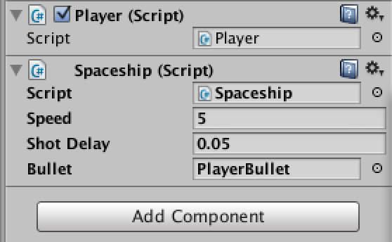
<br/>図4.1:


ゲームを再生してみて前章と同じ動きをするか確かめてみてください。

<span id="h4-2"></span>4.2　敵を表示する
----------------------------------------

第1章で作成した「Enemy」のPrefabをドラッグ＆ドロップしてシーンビューに表示します。


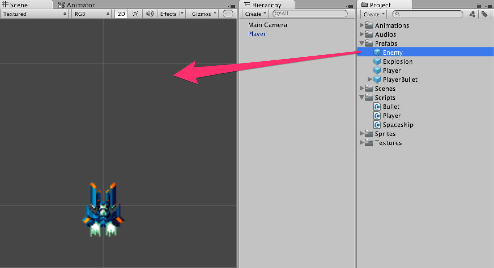
<br/>図4.2:


<span id="h4-3"></span>4.3　敵専用のスクリプトを書く
----------------------------------------------------

まずは、EnemyゲームオブジェクトにSpaceship.csをアタッチしましょう。


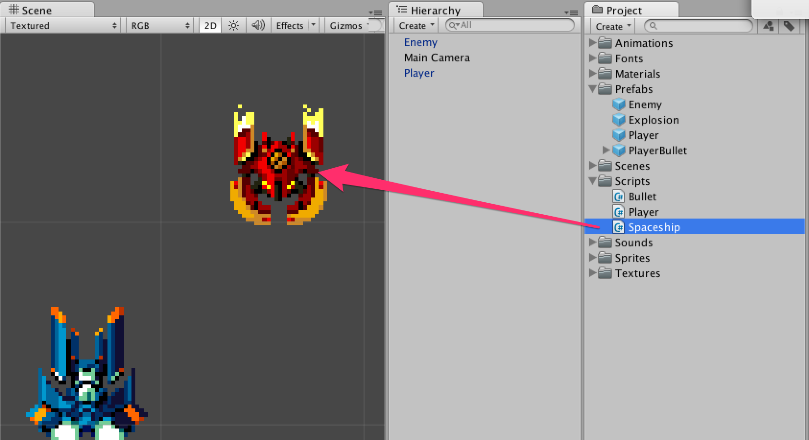
<br/>図4.3:


### <span id="h4-3-1"></span>敵の移動

新たに**Enemy.cs**をScriptsフォルダの中に作成します。
まずは、敵が下に移動するように実装をします。


Enemy.cs

```cs
using UnityEngine;
using System.Collections;

public class Enemy : MonoBehaviour
{
    // Spaceshipコンポーネント
    Spaceship spaceship;

    void Start ()
    {

        // Spaceshipコンポーネントを取得
        spaceship = GetComponent<Spaceship> ();

        // ローカル座標のY軸のマイナス方向に移動する
        spaceship.Move (transform.up * -1);
    }
}
```


### <span id="column-16"></span>transform.up

今回、Enemyの移動する向きはローカル座標を使って決定します。
本来であればワールド座標から計算を行いローカル座標を求めますが、私達は**transform.up**というような簡単なアクセスでローカル座標を使用することが可能です。


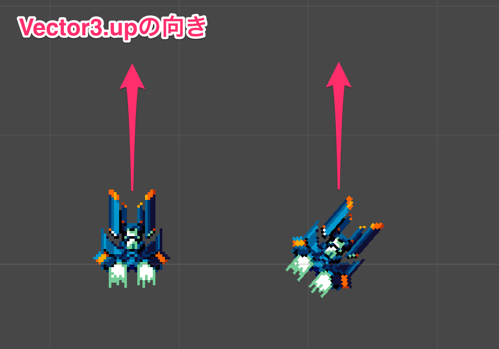


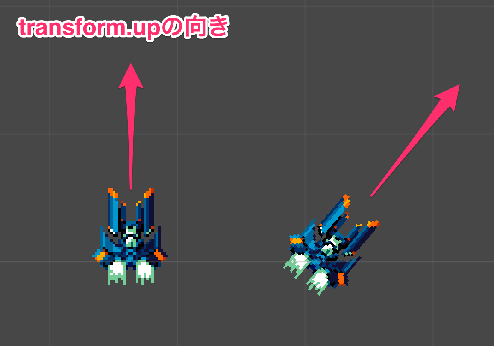


詳しくは[Transform](http://docs.unity3d.com/ja/current/ScriptReference/Transform.html)を御覧ください。


EnemyゲームオブジェクトにEnemyコンポーネントをアタッチし、Spaceshipの**speed**を**0.5**にしましょう。


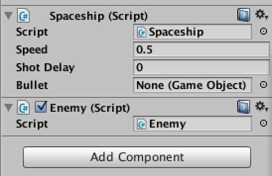
<br/>図4.4:


ゲームを再生してみましょう。下に移動しましたか？

### <span id="h4-3-2"></span>弾の作成

敵の弾となる`Bullet_1`スプライトをシーンビューへドラッグ＆ドロップします。


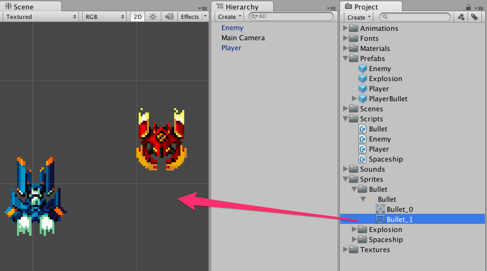
<br/>図4.5:


名前を**EnemyBullet**とします。
そして、**Bullet.cs**と**Rigidbody2D**をアタッチしましょう。
Bulletの**Speed**を**2**に、Rigidbody2Dの**Gravity
Scale**を**0**にしてください。


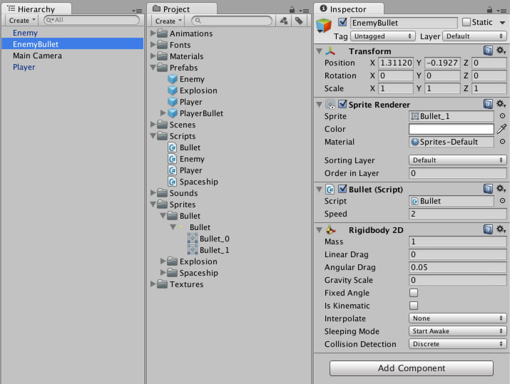
<br/>図4.6:


最後にPrefabとして保存を行い、EnemyにアタッチされているSpaceshipコンポーネントのBulletに**EnemyBullet**プレハブを格納してください。


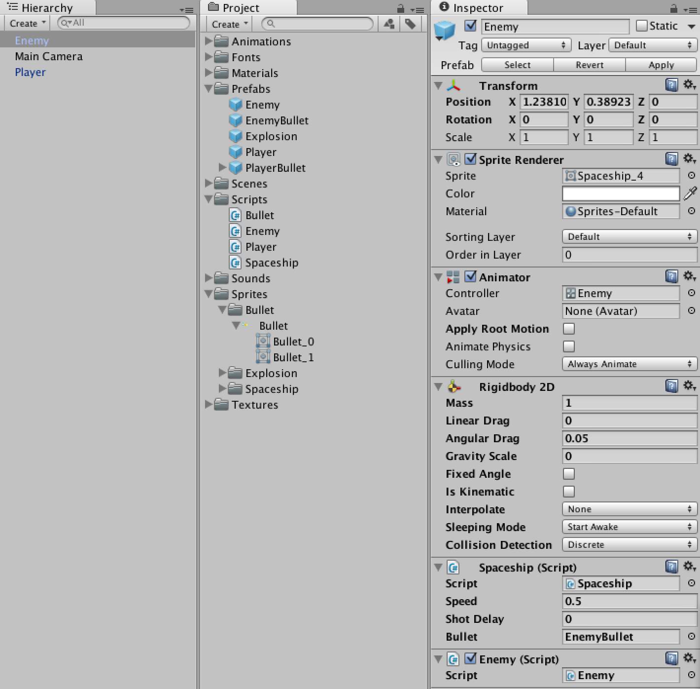
<br/>図4.7:


### <span id="h4-3-3"></span>弾の発射

弾の発射はプレイヤーとは少し異なる実装を行います。
敵は**「複数の異なる位置や角度で弾を撃つことが出来る」**ようにします。

#### <span id="h4-3-3-1"></span>ShotPositionの作成

敵の子要素として新たに**空のGameObject**を作成し、名前を**ShotPosition**とします。これを合計3つ作成しましょう。


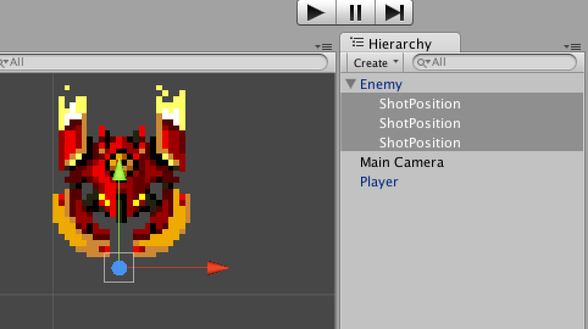
<br/>図4.8: 3つのShotPositionゲームオブジェクトは同じ位置


それぞれの角度を20度ずつ傾けますが、**ここで進行方向を考慮しましょう。何もしなければ今回の進行方向は上側になります。**
敵の弾は下方向に進まなければいけないので**Z軸を180度**にして進行方向を下側にした上で20度ずつ傾けるようにします。


表4.1: TransformのRotationを変更します

  ゲームオブジェクト名     X   Y   Z
  ------------------------ --- --- -----
  ShotPosition（その１）   0   0   160
  ShotPosition（その２）   0   0   180
  ShotPosition（その３）   0   0   200


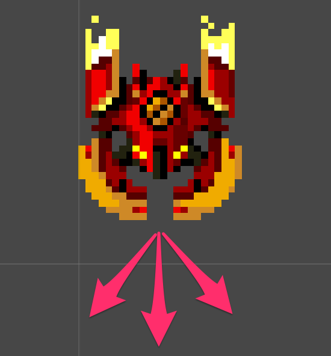
<br/>図4.9: 各ShotPositionを傾けた場合に弾が進む方向


これで撃つ時の弾の数と撃つ位置と角度が決まりました。

#### <span id="h4-3-3-2"></span>ShotPositionから弾を撃つ

先ほど作成したShotPositionをスクリプト側で取得してみます。Startメソッドをコルーチンに変更して、プレイヤーのようにwhile文の中で弾を撃ちます。


Enemy.cs

```cs
using UnityEngine;
using System.Collections;

public class Enemy : MonoBehaviour
{
    // Spaceshipコンポーネント
    Spaceship spaceship;

    IEnumerator Start ()
    {
        // Spaceshipコンポーネントを取得
        spaceship = GetComponent<Spaceship> ();

        // ローカル座標のY軸のマイナス方向に移動する
        spaceship.Move (transform.up * -1);

        while (true) {

            // 子要素を全て取得する
            for (int i = 0; i < transform.childCount; i++) {

                Transform shotPosition = transform.GetChild(i);

                // ShotPositionの位置/角度で弾を撃つ
                spaceship.Shot (shotPosition);
            }

            // shotDelay秒待つ
            yield return new WaitForSeconds (spaceship.shotDelay);
        }
    }
}
```


Enemyゲームオブジェクトの**Shot Delay**を**0.3**にします。
さてここでゲームを再生してみましょう。


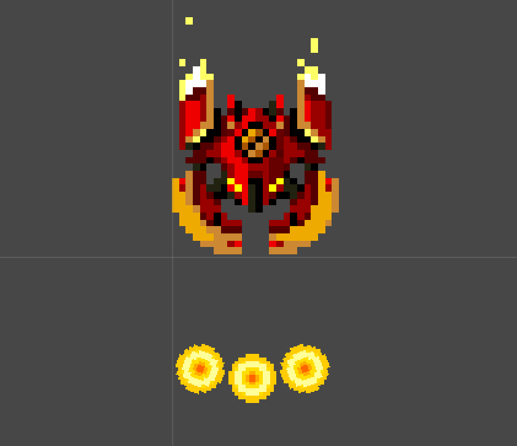
<br/>図4.10:


### <span id="h4-3-4"></span>弾を撃たない敵を作る

すべての敵が弾を撃っても良いのですが、今回は弾を撃たない敵も作成します。

#### <span id="h4-3-4-1"></span>Spaceship.csに変数の追加

弾を撃つか撃たないかの状態を`canShot`というbool型の変数で保持するようにします。


```cs
using UnityEngine;

[RequireComponent(typeof(Rigidbody2D))]
public class Spaceship : MonoBehaviour
{
    // 移動スピード
    public float speed;

    // 弾を撃つ間隔
    public float shotDelay;

    // 弾のPrefab
    public GameObject bullet;

    // 弾を撃つかどうか
    public bool canShot;

    // 弾の作成
    public void Shot (Transform origin)
    {
        Instantiate (bullet, origin.position, origin.rotation);
    }

    // 機体の移動
    public void Move (Vector2 direction)
    {
        rigidbody2D.velocity = direction * speed;
    }
}
```


#### <span id="h4-3-4-2"></span>Enemy.csの修正

弾を撃つ処理としてStartメソッドをコルーチンとして実行していますが弾を撃つ必要がない時は`yield break;`を使用してコルーチンを終了させます。


Enemy.cs

```cs
using UnityEngine;
using System.Collections;

public class Enemy : MonoBehaviour
{
    // Spaceshipコンポーネント
    Spaceship spaceship;

    IEnumerator Start ()
    {
        // Spaceshipコンポーネントを取得
        spaceship = GetComponent<Spaceship> ();

        // ローカル座標のY軸のマイナス方向に移動する
        spaceship.Move (transform.up * -1);

        // canShotがfalseの場合、ここでコルーチンを終了させる
        if (spaceship.canShot == false) {
            yield break;
        }

        while (true) {

            // 子要素を全て取得する
            for (int i = 0; i < transform.childCount; i++) {

                Transform shotPosition = transform.GetChild(i);

                // ShotPositionの位置/角度で弾を撃つ
                spaceship.Shot (shotPosition);
            }

            // shotDelay秒待つ
            yield return new WaitForSeconds (spaceship.shotDelay);
        }
    }
}
```


スクリプトでtrue、インスペクターでチェックを付けると弾を撃てるようになります。


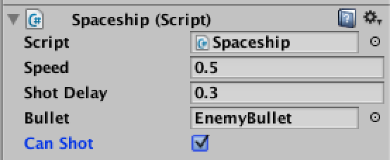
<br/>図4.11:


これで弾を撃たない敵が出来上がりました


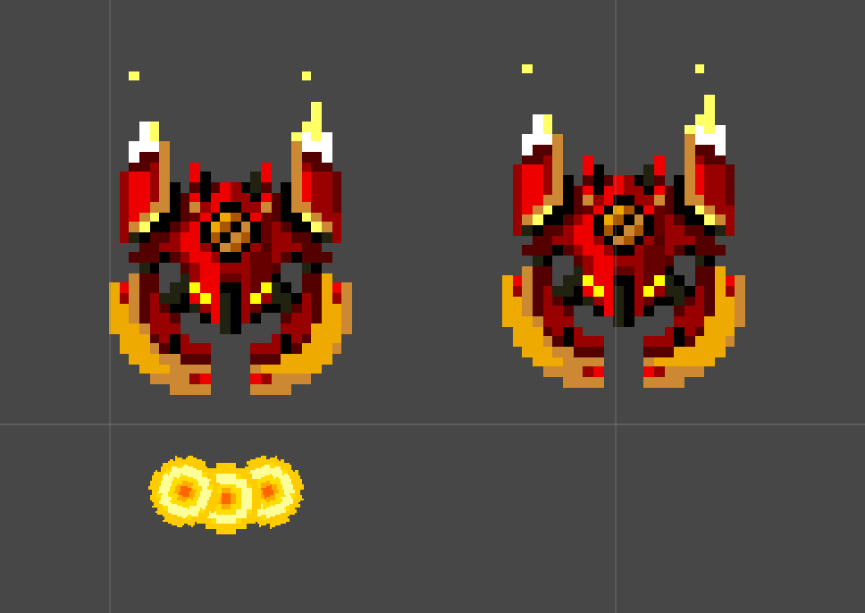
<br/>図4.12:


最後に、シーンとプレハブをきちんと更新しましょう！

### 第04回終わり

今回はここで終了です。つまずいてしまった方はプロジェクトファイルをダウンロードして新たな気持ちで次の回へ進みましょう。

[今回のプロジェクトファイルをダウンロード](./project/game_04_ShootingGame.zip)
