現状ではWaveが1つしかありません。これを5つまで増やし、更にスコアを実装します。


<span id="h12-1"></span>12.1　Waveの作成
----------------------------------------

Waveをさらに4つ増やします。[第07回](./07.html)で作成したWaveプレハブを複製したものを改良していきます。Waveのエネミーの配置は同じにしなくても問題ありません。例として4つのWaveを紹介します。

[Wave.unitypackageをダウンロード](./project/Wave.unitypackage)

### <span id="h12-1-1"></span>Wave 2

弾を打たない、HPが4の大量のエネミー


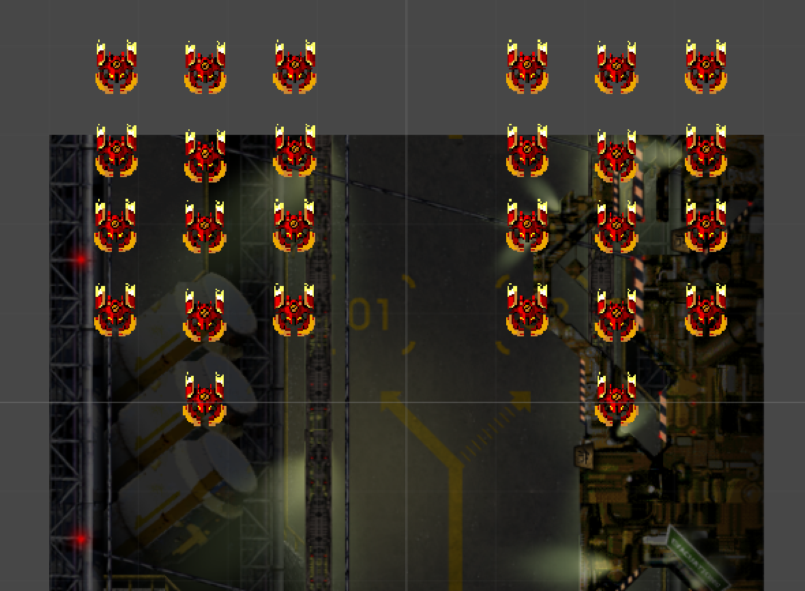


### <span id="h12-1-2"></span>Wave 3

弾を撃つ、HP10のエネミー


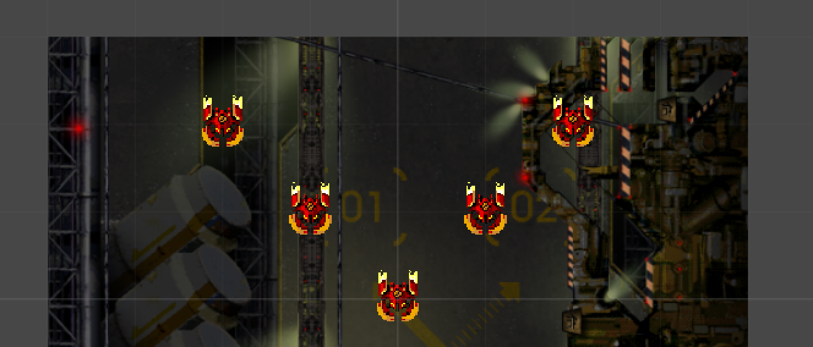


### <span id="h12-1-3"></span>Wave 4

左右から登場する弾を撃つ、HP10のエネミー


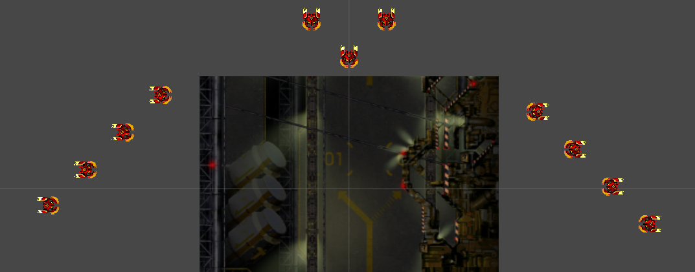


### <span id="h12-1-4"></span>Wave 5

大きさが3倍で、弾を一度に大量に撃つ、HP100のエネミー


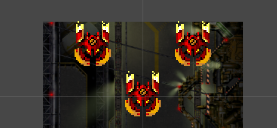


作成できたら**Emitter**ゲームオブジェクトをクリックし、インスペクターのWavesへドラッグ＆ドロップしてWaveを追加します。


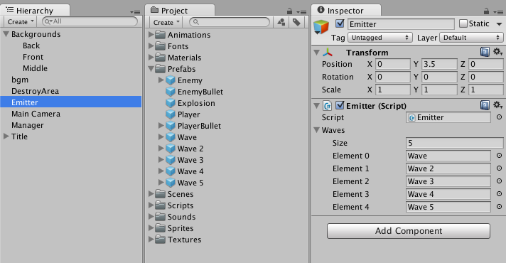


ゲームを再生してみましょう。Wave → Wave 2 → Wave 3 → Wave 4 → Wave 5 →
Wave ... と延々とループしているはずです。
少し難しいと感じたら自分で難易度を調整してみましょう。エネミーのHPや向きや移動スピード、ShotPositionゲームオブジェクトの増減で調整可能です。

<span id="h12-2"></span>12.2　スコアの実装
------------------------------------------

最後の要素として「スコア」を実装します。
今回はゲーム中に獲得した現在のスコアと、今までのハイスコアを実装します。

### <span id="h12-2-1"></span>スコアの表示

スコアを画面に表示するためにGUITextを配置します。
**空のゲームオブジェクト**を作成し、名前を**Score
GUI**としましょう。Transformの**Positionは X 0 Y 0 Z 0**にしてください。


Hierarchyウィンドウの**Create**ボタンをクリックして**GUI
Text**を選択してください。GUI
Textコンポーネントが付いたゲームオブジェクトが作成されます。


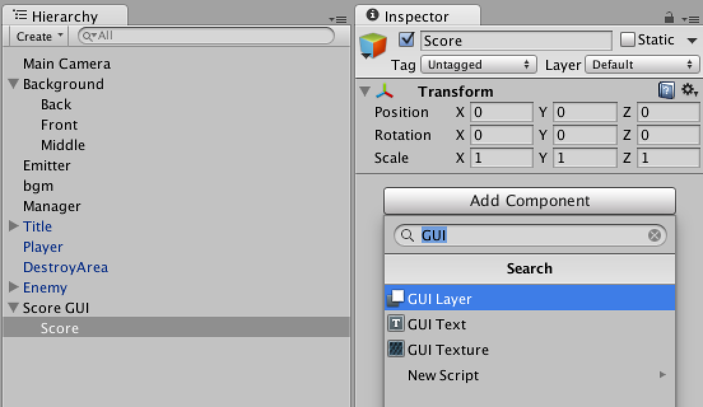


同じものをもう１つ作成し、**Score
GUI**の子要素とします。そして、名前を**Score**と**HighScore**にしましょう。


**Score**と**HighScore**の設定を行います。
**TransformのPosition**、**GUITextのText**、**Anchor**、**Font**、**Font
Size**を図12.1と図12.2を見ながら設定しましょう。


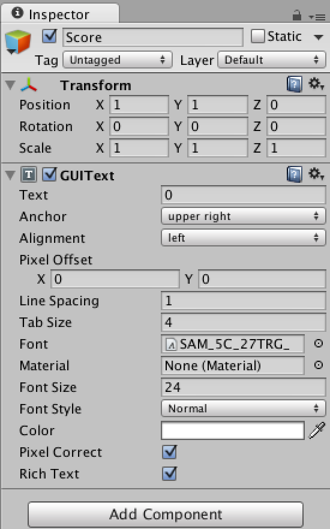
<br/>図12.1:


<br/>図12.2:


正しく設定を行うと図12.3のようにゲームビューの右上と右下に**0**と表示が行われます。


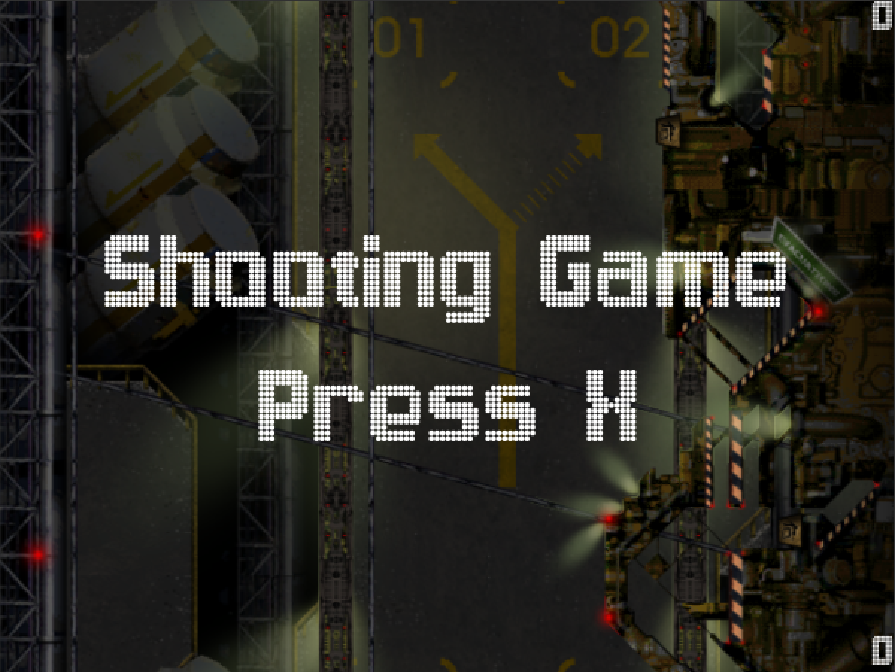
<br/>図12.3:


### <span id="h12-2-2"></span>スクリプトの作成

**Score.cs**を**Scripts**フォルダ配下に作成してください。


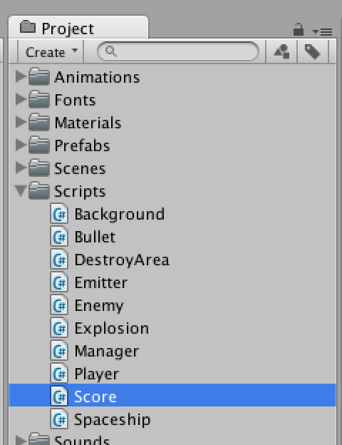


今回、スコアの保存は`PlayerPrefs`クラスを使用して保存します。


### <span id="column-32"></span>PlayerPrefs

このクラスはゲームで保存しておきたいデータを保存するためのクラスです。
例えばゲームの進行度やサウンドのボリューム、ハイスコア、ランキング、などはPlayerPrefsでデータを保持することで実現できます。
細かな制限もあるので、詳しくはドキュメントの[PlayerPrefs](http://docs.unity3d.com/ja/current/ScriptReference/PlayerPrefs.html)を御覧ください。


Score.cs

```cs
using UnityEngine;

public class Score : MonoBehaviour
{
        // スコアを表示するGUIText
        public GUIText scoreGUIText;

        // ハイスコアを表示するGUIText
        public GUIText highScoreGUIText;

        // スコア
        private int score;

        // ハイスコア
        private int highScore;

        // PlayerPrefsで保存するためのキー
        private string highScoreKey = "highScore";

        void Start ()
        {
                Initialize ();
        }

        void Update ()
        {
                // スコアがハイスコアより大きければ
                if (highScore < score) {
                        highScore = score;
                }

                // スコア・ハイスコアを表示する
                scoreGUIText.text = score.ToString ();
                highScoreGUIText.text = "HighScore : " + highScore.ToString ();
        }

        // ゲーム開始前の状態に戻す
        private void Initialize ()
        {
                // スコアを0に戻す
                score = 0;

                // ハイスコアを取得する。保存されてなければ0を取得する。
                highScore = PlayerPrefs.GetInt (highScoreKey, 0);
        }

        // ポイントの追加
        public void AddPoint (int point)
        {
                score = score + point;
        }

        // ハイスコアの保存
        public void Save ()
        {
                // ハイスコアを保存する
                PlayerPrefs.SetInt (highScoreKey, highScore);
                PlayerPrefs.Save ();

                // ゲーム開始前の状態に戻す
                Initialize ();
        }
}
```


作成した**Score.cs**を**Score
GUI**ゲームオブジェクトにドラッグ＆ドロップしてください。


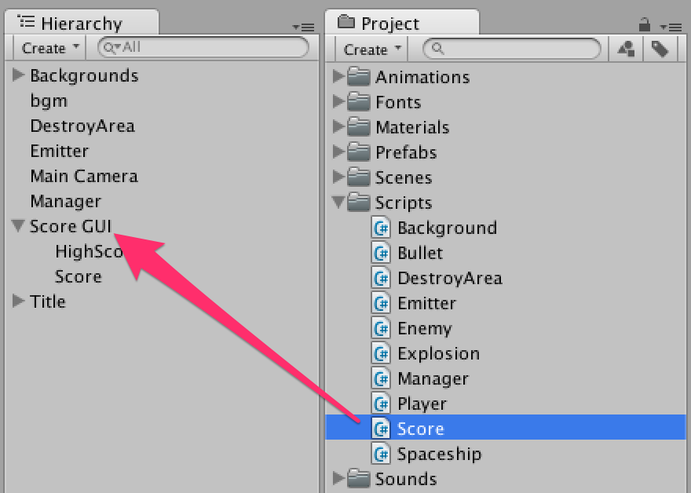


インスペクターの**Score GUIText**と**High Score
GUIText**に**Score**ゲームオブジェクトと**HighScore**ゲームオブジェクトをそれぞれドラッグ＆ドロップします。


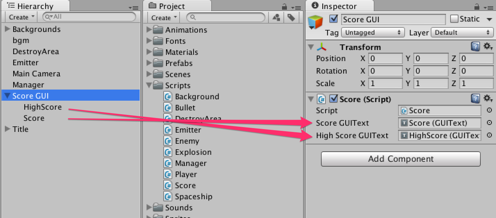


これでスコアを表示する準備が出来ました。次はスコアのポイントを追加していく処理を実装していきます。

### <span id="h12-2-3"></span>エネミーにポイントを持たせる

エネミーを倒したらポイントを追加していきます。そのために**Enemy.cs**にポイントを保持する変数を加えましょう。
そして、OnTriggerEnter2Dメソッド内で爆発する時にスコアにポイントを追加する処理を追加します。


Enemy.cs

```cs
using UnityEngine;
using System.Collections;

public class Enemy : MonoBehaviour
{
        // ヒットポイント
        public int hp = 1;

        // スコアのポイント
        public int point = 100;

        // Spaceshipコンポーネント
        Spaceship spaceship;

        IEnumerator Start ()
        {

                // Spaceshipコンポーネントを取得
                spaceship = GetComponent<Spaceship> ();

                // ローカル座標のY軸のマイナス方向に移動する
                Move (transform.up * -1);

                // canShotがfalseの場合、ここでコルーチンを終了させる
                if (spaceship.canShot == false) {
                        yield break;
                }

                while (true) {

                        // 子要素を全て取得する
                        for (int i = 0; i < transform.childCount; i++) {

                                Transform shotPosition = transform.GetChild (i);

                                // ShotPositionの位置/角度で弾を撃つ
                                spaceship.Shot (shotPosition);
                        }

                        // shotDelay秒待つ
                        yield return new WaitForSeconds (spaceship.shotDelay);
                }
        }

        // 機体の移動
        public void Move (Vector2 direction)
        {
                rigidbody2D.velocity = direction * spaceship.speed;
        }

        void OnTriggerEnter2D (Collider2D c)
        {
                // レイヤー名を取得
                string layerName = LayerMask.LayerToName (c.gameObject.layer);

                // レイヤー名がBullet (Player)以外の時は何も行わない
                if (layerName != "Bullet (Player)") return;

                // PlayerBulletのTransformを取得
                Transform playerBulletTransform = c.transform.parent;

                // Bulletコンポーネントを取得
                Bullet bullet =  playerBulletTransform.GetComponent<Bullet>();

                // ヒットポイントを減らす
                hp = hp - bullet.power;

                // 弾の削除
                Destroy(c.gameObject);

                // ヒットポイントが0以下であれば
                if(hp <= 0 )
                {
                        // スコアコンポーネントを取得してポイントを追加
                        FindObjectOfType<Score>().AddPoint(point);

                        // 爆発
                        spaceship.Explosion ();

                        // エネミーの削除
                        Destroy (gameObject);

                }else{

                        spaceship.GetAnimator().SetTrigger("Damage");

                }
        }
}
```


それぞれのWaveプレハブ内にあるEnemyでポイントを調整します。HPが高いほど高得点にしたり、難易度によって得点を変化させてみましょう。


ゲームを再生してみましょう。敵を倒すとスコアにポイントが加算され、ハイスコアを更新すれば右下のハイスコアがリアルタイムで更新されていきます。


### <span id="h12-2-4"></span>ハイスコアの保存

最後にゲームオーバーの時にハイスコアを保存するようにします。
Manager.csのGameOverメソッドに追記します。


Manager.cs

```cs
using UnityEngine;

public class Manager : MonoBehaviour
{
        // Playerプレハブ
        public GameObject player;

        // タイトル
        private GameObject title;

        void Start ()
        {
                // Titleゲームオブジェクトを検索し取得する
                title = GameObject.Find ("Title");
        }

        void Update ()
        {
                // ゲーム中ではなく、Xキーが押されたらtrueを返す。
                if (IsPlaying () == false && Input.GetKeyDown (KeyCode.X)) {
                        GameStart ();
                }
        }

        void GameStart ()
        {
                // ゲームスタート時に、タイトルを非表示にしてプレイヤーを作成する
                title.SetActive (false);
                Instantiate (player, player.transform.position, player.transform.rotation);
        }

        public void GameOver ()
        {
                // ハイスコアの保存
                FindObjectOfType<Score>().Save();

                // ゲームオーバー時に、タイトルを表示する
                title.SetActive (true);
        }

        public bool IsPlaying ()
        {
                // ゲーム中かどうかはタイトルの表示/非表示で判断する
                return title.activeSelf == false;
        }
}
```


お疲れ様でした。ゲーム制作編は以上で終了となります。

### 第12回終わり

今回はここで終了です。つまずいてしまった方はプロジェクトファイルをダウンロードして新たな気持ちで次の回へ進みましょう。

[今回のプロジェクトファイルをダウンロード](./project/game_12_ShootingGame.zip)
